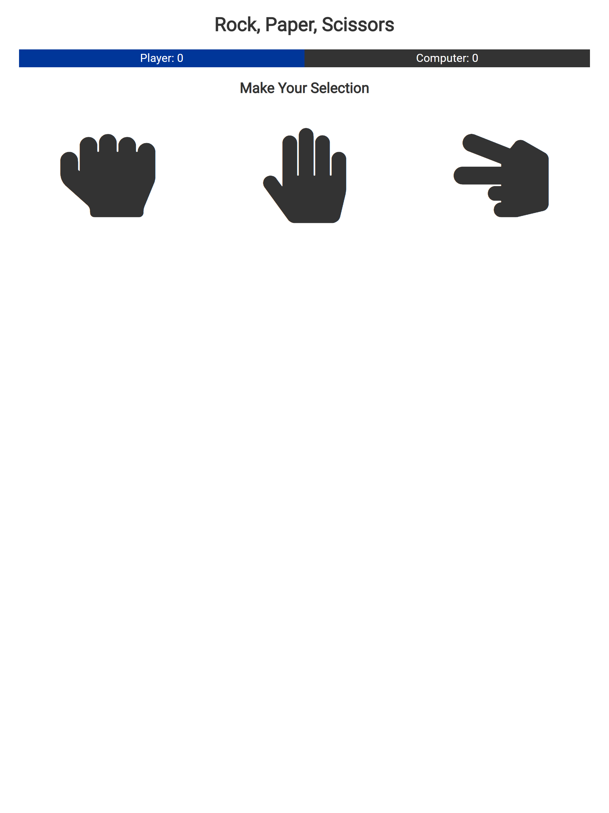

# Vanilla JS - Rock, Paper, Scissors
### Live Demo:
https://rockpapersciss0r.netlify.app/

### About:
Utilizing vanilla JavaScript this is a fully-functional Rock, Paper, Scissors game.  While most of the technologies and logic used in this project were not new to me, it gave the opportunity to work with ```charAt(0)``` combined with ```slice()``` to easily capitalize the first letter of a word... something I've yet to learn.




### Acknowledgement:

Thanks to Traversy Media for this awesome tutorial.
